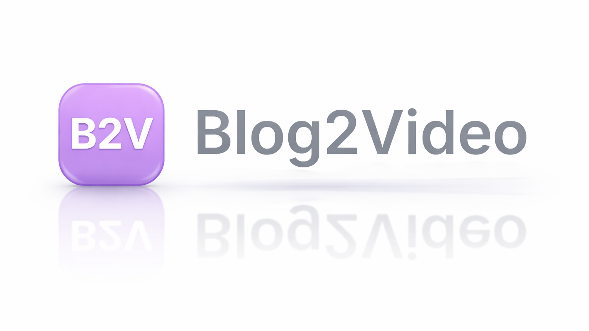

  

  🎬 <strong>Turn any blog post into a professional AI-powered video in minutes.</strong>

  <a href="https://www.youtube.com/watch?v=w3Vq8KhDzPU" target="_blank">
    ▶ Watch Product Demo
  </a>

---

## 🚀 Key Features of Blog2Video

**Blog2Video** is designed to make video creation fast, flexible, and fully customizable. Here’s what users can do:

### 🎨 Multiple Video Templates
- Access a variety of pre-designed templates for different video styles: **storytelling, promotional, explainer, and marketing videos**.  
- Templates give your videos a professional look instantly, saving hours of design work.

### ✨ Custom Templates
- Design your own video templates from scratch by providing the link of your favourite theme.  
- Fully customize layouts, text styles, and voiceovers.  
- Reuse custom templates for consistent branding across multiple videos.

### 🗂 Bulk Video Creation
- Paid users can generate multiple videos at once.  
- Ideal for **content campaigns, social media posts, or educational series**.  
- Eliminates repetitive tasks while maintaining high-quality results.

### 🗣 Custom Voice Generation
- Paid users can generate voiceovers in the voice of their choice.  
- Supports multiple languages and tones to match your audience or brand personality.  
- Perfect for personalized narration in professional videos.

### 🔄 Full Editing Flexibility
- Edit any scene or element of your video freely.  
- Adjust text, animations, visuals, and voiceovers exactly how you want.  
- AI-assisted editing allows you to refine scripts and scenes using natural language commands.

### 💬 AI-Assisted Script Refinement
- Automatically generates a video script from your blog content.  
- AI chat editor helps tweak scripts, or improve narration.  
- Ensures that every video communicates your message clearly and effectively.

### 🚀 Quick and Automated Workflow
- Paste a blog URL and generate a professional video within minutes.  
- AI handles script writing, scene generation, animations, and voiceovers automatically.  
- Lets creators focus on storytelling rather than manual production tasks.

### 🎞 Ready-to-Publish Output
- Export production-ready videos suitable for **YouTube, social media, websites, or marketing campaigns**.  
- No additional editing software required — videos are ready to go.

---

## 🛠 How It Works

1. **Sign in** with Google on the landing page.  
2. **Create a project** by pasting your blog URL.  
3. **Select a template or style** — choose from multiple formats or use your custom template.  
4. **Generate your video automatically** — AI creates the script, animates scenes, and adds voiceovers.  
5. **Edit freely** — refine scenes, text, animations, and voiceovers as needed.  
6. **Export your video** — ready for publishing on any platform.  

Blog2Video combines **AI-powered automation with full creative control**, making video production faster, easier, and more engaging than ever.

---

<table>
  <tr>
    <th>Title</th>
    <th>Emoji</th>
    <th>Color From</th>
    <th>Color To</th>
    <th>SDK</th>
    <th>App Port</th>
    <th>Short Description</th>
  </tr>
  <tr>
    <td>Blog2Video</td>
    <td>🎬</td>
    <td>blue</td>
    <td>purple</td>
    <td>docker</td>
    <td>7860</td>
    <td>Convert blog posts into AI-powered videos with templates, custom styles, bulk creation, custom voices, and full editing flexibility</td>
  </tr>
</table>
